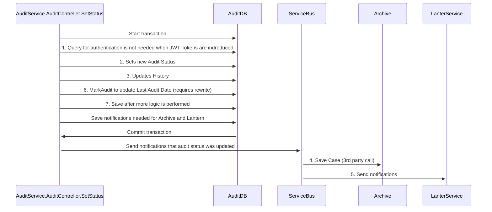

# API Specification: Customers and Installations

# Testing mermaid

## Overview
This API provides the functionality to create, update, delete, and retrieve customers and plant data from Cubit Core. The API uses "upsert" endpoints for creating and updating, meaning the same endpoint handles both insertions and updates.

## Endpoints
### Customers
- **Create/Update**: `[POST]` Endpoint with details on request parameters, headers, and example JSON body.
- **Delete**: `[DELETE]` Endpoint with required parameters and headers.
- **Retrieve**: `[GET]` Endpoint with required parameters and headers.

### Installations
- **Create/Update**: `[POST]` Endpoint for installations with details on request parameters, headers, and JSON body structure.
- **Delete**: `[DELETE]` Endpoint for installations.
- **Retrieve**: `[GET]` Endpoint for installations.

## Additional Information
- **Environment Parameters**: Details on the 'test' and 'prod' environment parameters.
- **API Key**: Information on the necessity of the API key in headers for authorization.
- **Error Handling**: Description of common error responses like 401 - Unauthorized and 400 - Bad Request.

## Example Requests
- Provide JSON examples for creating or updating customers and installations.
- Describe scenarios where these examples can be applied.

## Contact
For further information or queries, contact Mindaugas Guzas at mindaugas@cubit.no
